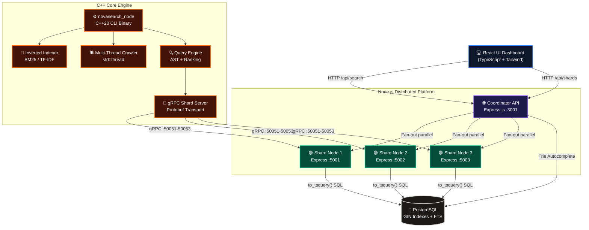

<div align="center">

# 🌌 NovaSearch

### *A Production-Grade Distributed Search Engine*

**A two-layer architecture combining a high-performance C++20 core engine with a real-time distributed Node.js microservices platform and a dynamic React telemetry dashboard.**

<br/>

[](https://en.cppreference.com/w/cpp/20)
[](https://grpc.io/)
[](https://www.typescriptlang.org/)
[](https://reactjs.org/)
[](https://www.postgresql.org/)
[](https://nodejs.org/)
[](https://cmake.org/)

</div>

---

## ⚡ What Is This?

NovaSearch is a **full-stack distributed search engine** built in two layers:

| Layer | Technology | Role |
|---|---|---|
| 🔩 **Core Engine** | **C++20 + gRPC + Protobuf** | BM25/TF-IDF ranking, inverted indexes, shards, crawler |
| 🌐 **Platform Layer** | **Node.js + PostgreSQL** | Distributed coordinator microservices, full-text search |
| 🖥️ **Dashboard UI** | **React + TypeScript** | Real-time telemetry, cluster monitoring, dynamic visualization |

---

## 🏗️ Full Architecture



---

## 🔩 C++ Core Engine (Layer 1)

The heart of NovaSearch — a **C++20 search engine** with zero runtime dependencies beyond gRPC and Protobuf. Built to Google engineering standards.

**Standard: `C++20`** | **Build System: `CMake 3.20+`** | **Transport: `gRPC + Protocol Buffers`**

### Modules

| Module | File | Description |
|---|---|---|
| 🕷️ **Crawler** | `crawler/crawler.cpp` | Multi-threaded BFS web crawler with configurable thread pool and crawl depth |
| 📄 **Parser** | `parser/parser.cpp` | HTML stripping and token extraction for indexable content |
| 📖 **Indexer** | `indexer/indexer.cpp` | Inverted index builder: maps terms → posting lists with frequencies |
| 🎯 **Ranking** | `ranking/ranking.cpp` | Pluggable `RankingStrategy` interface with **BM25** and **TF-IDF** implementations |
| 🔍 **Query Engine** | `query_engine/query_engine.cpp` | AST query parsing with boolean operators (`AND`, `OR`, `NOT`) |
| 🔤 **Spell Corrector** | `spell_corrector/spell_corrector.cpp` | Edit-distance based correction with known-words Levenshtein matching |
| 📡 **Shard Server** | `shards/shard_server.cpp` | gRPC server implementing the distributed `SearchService` Protobuf contract |
| 🗺️ **Coordinator** | `coordinator/coordinator.cpp` | Fan-out orchestrator that dispatches parallel gRPC calls to active leaf shards |

### CLI Usage

```bash
# Build
mkdir build && cd build
cmake .. && make -j$(nproc)

# Crawl a website
./novasearch_node crawl https://example.com

# Search the index with BM25 ranking
./novasearch_node search "distributed consensus" --rank bm25

# Search with TF-IDF ranking
./novasearch_node search "inverted index" --rank tfidf

# Start a distributed shard node on a port
./novasearch_node cluster 50051

# Run unit tests (Google Test)
ctest --output-on-failure
```

---

## 🌐 Node.js Platform Layer (Layer 2)

The distributed microservices layer that bridges the C++ engine with the modern web dashboard. Uses **PostgreSQL** for durable document storage with native full-text search indexing.

### Services

| Service | Port | Role |
|---|---|---|
| **Coordinator** | `:3001` | API gateway, fan-out orchestrator, query cache, autocomplete |
| **Shard 1** | `:5001` | Independent search partition (Postgres shard 1) |
| **Shard 2** | `:5002` | Independent search partition (Postgres shard 2) |
| **Shard 3** | `:5003` | Independent search partition (Postgres shard 3) |

---

## 🖥️ Dynamic UI Dashboard (Layer 3)

A real-time cluster monitoring and search interface that makes the distributed system fully **observable**.

- **🔴 Live gRPC / HTTP Trace Logs** — Watch fan-out calls dispatched to shards frame-by-frame as you search
- **📊 Interactive Topology Graphs** — CPU, Memory, and Latency sparkline charts updating every 3 seconds per node
- **⚠️ Fault Injection Sandbox** — Toggle individual shard nodes offline to observe degraded-mode query execution
- **🕷️ Live Crawler Terminal** — Submit URLs, watch HTML parsing and tokenization logs stream live into PostgreSQL
- **🔤 Real-Time Autocomplete** — Prefix-trie suggestions from the `autocomplete_trie` Postgres table as you type
- **🌳 AST Query Visualizer** — View how boolean query expressions are parsed into an Abstract Syntax Tree

---

## 📂 Project Structure

```text
NovaSearch/
│
├── novasearch/              # ⚙️  C++20 Core Engine
│   ├── main.cpp             # CLI entry point (crawl / search / cluster modes)
│   ├── CMakeLists.txt       # CMake build (C++20, gRPC, Protobuf, GTest)
│   ├── crawler/             # Multi-threaded BFS web crawler
│   ├── parser/              # HTML stripping & tokenization
│   ├── indexer/             # Inverted index (term → posting lists)
│   ├── ranking/             # BM25 + TF-IDF RankingStrategy implementations
│   ├── query_engine/        # AST query parser & ranked retrieval
│   ├── spell_corrector/     # Levenshtein edit-distance correction
│   ├── coordinator/         # gRPC fan-out coordinator
│   ├── shards/              # gRPC shard server
│   ├── networking/          # search.proto — Protobuf definitions
│   ├── cache/               # LRU query cache
│   ├── autocomplete/        # Prefix trie
│   ├── benchmarks/          # Performance benchmarks
│   └── tests/               # Google Test unit tests
│
├── server/                  # 🌐  Node.js Microservices
│   ├── coordinator.ts       # API gateway & HTTP fan-out to shards
│   ├── shard.ts             # Per-shard Express server (Postgres queries)
│   ├── db.ts                # PostgreSQL connection pool
│   └── init_db.ts           # Schema bootstrap & data seeder
│
├── src/                     # 🖥️  React Dashboard UI
│   ├── components/
│   │   ├── ClusterOverview.tsx    # Live telemetry charts & node status
│   │   ├── SearchPlayground.tsx   # Search UI + trace log visualizer
│   │   ├── CrawlerSandbox.tsx     # Live URL ingestion terminal
│   │   ├── ArchitectureModeler.tsx
│   │   └── CodeBrowser.tsx
│   ├── App.tsx
│   └── types.ts
│
├── vite.config.ts           # Vite dev server + proxy to :3001
└── package.json             # npm scripts
```

---

## 🚀 Quick Start

### Prerequisites
- **Node.js** v18+
- **PostgreSQL** on port `5432` (user: `postgres`, pass: `root`)
- *(Optional for C++ engine)* **CMake 3.20+**, **gRPC**, **Protobuf**, **GTest**

### 1. Install & Initialize

```bash
git clone https://github.com/venkatanaveen2078909-rgb/NovaSearch.git
cd NovaSearch
npm install
npm run db:init        # Creates database, tables, and seeds documents
```

### 2. Run the Full Platform

```bash
npm run dev            # Vite frontend + Coordinator + 3 Shard microservices
```

> Opens at `http://localhost:3000` with the live dashboard.

### 3. (Optional) Build the C++ Engine

```bash
cd novasearch
mkdir build && cd build
cmake .. -DCMAKE_BUILD_TYPE=Release
make -j$(nproc)
./novasearch_node search "distributed systems" --rank bm25
```

---

<div align="center">
  <br/>
  <sub>Built with precision for high-performance distributed systems.</sub>
</div>
