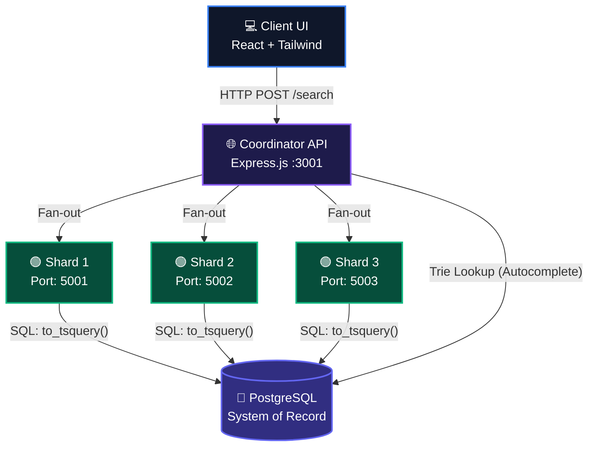

<div align="center">
  <h1>🌌 NovaSearch</h1>
  <p><strong>A high-performance, distributed search engine with dynamic UI and real PostgreSQL full-text search backend.</strong></p>
  
  <p>
    
    
    
    
    
    
  </p>
</div>

---

## 🌟 Dynamic UI Experience

NovaSearch features a **hyper-dynamic, fluid user interface** designed to visualize complex distributed systems in real-time. It isn't just a search bar; it's a complete telemetry dashboard.

- **Real-Time Telemetry Logs**: Watch live gRPC / HTTP tracing as the Coordinator node fans out to Shards and resolves candidate pools.
- **Interactive Topology Graphs**: See live CPU, Memory, and Latency metrics of each partitioned shard node dynamically updating.
- **Fault Injection Sandbox**: Visually toggle shard nodes offline in the UI to see how the system handles partition failures during queries.
- **Live Crawler Terminal**: A sandbox where you can submit URLs and watch the real-time parsing, tokenization, and PostgreSQL ingestion logs stream dynamically into view.

---

## 🏗️ Architecture Design

NovaSearch uses a modern, distributed microservices architecture to process and retrieve documents at scale. 



### Components
1. **The Coordinator**: Acts as the API Gateway. It receives search queries, queries the autocomplete prefix trie, and orchestrates parallel HTTP fan-out requests to the leaf shards. It merges and re-scores results.
2. **The Shard Nodes**: Independent Express microservices that act as logical partitions. Each shard independently queries the central PostgreSQL storage.
3. **The Database Engine**: Uses Postgres native `to_tsvector` and `GIN` indexes to provide blazing-fast, scalable full-text searching (simulating BM25/TF-IDF scoring).

---

## 📂 Project Structure

```text
NovaSearch/
├── server/                 # Backend Node.js Services
│   ├── coordinator.ts      # API Gateway & Fan-out logic
│   ├── shard.ts            # Leaf node query & indexing logic
│   ├── db.ts               # Postgres connection pooling
│   └── init_db.ts          # Database schema & bootstrapping script
├── src/                    # Frontend React Application
│   ├── components/         # Modular Dynamic UI Components
│   │   ├── ClusterOverview.tsx   # Live telemetry & node status graphs
│   │   ├── SearchPlayground.tsx  # Interactive search, tracing, & AST viewer
│   │   ├── CrawlerSandbox.tsx    # Live URL ingestion simulator
│   │   ├── ArchitectureModeler.tsx 
│   │   └── CodeBrowser.tsx
│   ├── App.tsx             # Main dashboard assembly
│   ├── data.ts             # Default seed dictionaries
│   └── types.ts            # TypeScript interfaces
├── vite.config.ts          # Vite build & backend API Proxy settings
└── package.json            # Scripts & Dependencies
```

---

## 🚀 Quick Start

### 1. Prerequisites
- **Node.js** (v18+)
- **PostgreSQL** running locally on default port 5432 
  - *Ensure your credentials are User: `postgres`, Password: `root` (or update `.env`)*

### 2. Installation
Clone the repository and install all frontend/backend dependencies:
```bash
git clone https://github.com/venkatanaveen2078909-rgb/NovaSearch.git
cd NovaSearch
npm install
```

### 3. Initialize the Database
Bootstrap the `novasearch` database, build the tables, and seed the initial indexes:
```bash
npm run db:init
```

### 4. Run the Full Cluster
Spin up the Vite frontend and all **4 backend microservices** (Coordinator + 3 Shards) concurrently with one command:
```bash
npm run dev
```

The dynamic dashboard will automatically open at `http://localhost:3000`. 

> **Pro Tip**: Open the `Crawler Sandbox` tab first, ingest a few URLs, and then flip to the `Search` tab to watch your newly indexed documents dynamically retrieved across the shards!

---

<div align="center">
  <sub>Engineered for Distributed Search Performance.</sub>
</div>
